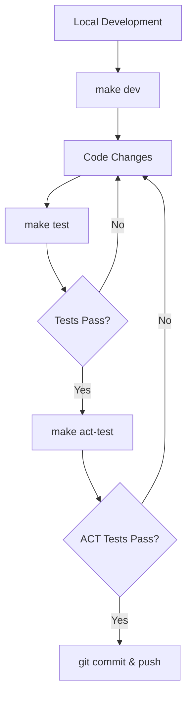
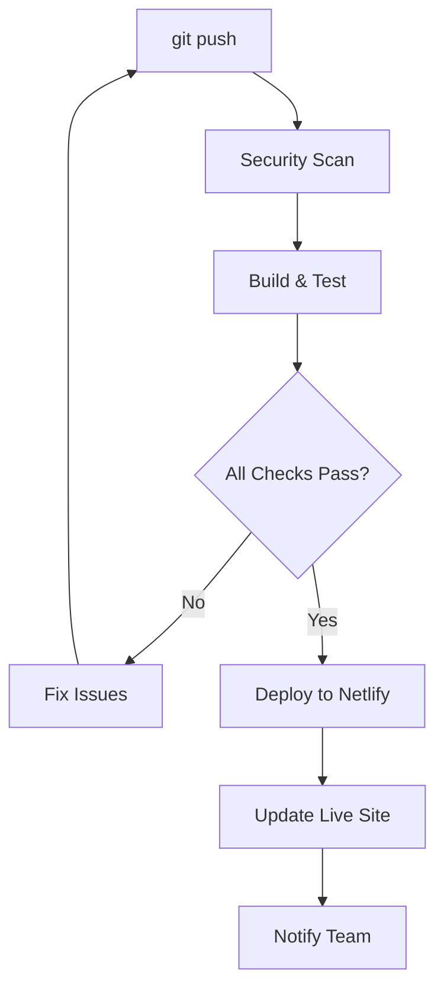

# Open Systems Lab Homepage

Homepage for Open Systems Lab - AI Infrastructure Consulting & Cloud Solutions

## Overview

This website showcases Open Systems Lab's expertise in AI infrastructure consulting, Kubernetes, cloud solutions, and DevOps automation. Built with Hugo and the PaperMod theme for optimal performance and professional presentation.

## Technical Details

- **Static Site Generator**: Hugo v0.148.2 (extended)
- **Theme**: PaperMod
- **Deployment**: Netlify with GitHub Actions
- **Build Time**: ~40ms (optimized)

## Quick Start

### Prerequisites

- Hugo v0.148.2+ (extended version)
- Git

### Installation

```bash
# Clone the repository
git clone https://github.com/opensystemslab/homepage.git
cd homepage

# Initialize theme submodule
git submodule update --init --recursive

# Start development server
hugo server --buildDrafts --buildFuture
```

Site will be available at `http://localhost:1313`

### Production Build

```bash
# Build optimized site
hugo --minify --environment production
```

## Development Workflow

### Local Development (Makefile-Based)

The entire development, testing, and deployment process can be managed locally using our comprehensive Makefile:

```bash
# Show all available commands
make help

# Install dependencies and setup
make install

# Start development server
make dev          # or make serve

# Run comprehensive local tests
make test

# Build for production
make build

# Clean build artifacts
make clean
```

### Advanced Local Testing

**ACT (Local GitHub Actions Testing):**
Test GitHub Actions workflows locally before pushing:

```bash
# Install ACT (macOS)
brew install act

# Run full test suite locally
make act-test

# Run security analysis locally
make act-security

# Run build-only tests
make act-test-build

# Run lint-only tests
make act-test-lint

# Dry run to see what would execute
make act-dry-run
```

**Local Security Testing:**
```bash
# Full security analysis
make act-security

# Secrets-only scanning
make act-security-secrets

# List all available ACT workflows
make act-list
```

### Development Helpers

```bash
# Watch for changes and auto-rebuild
make watch

# Build and serve production version locally
make preview

# Lint configuration and content
make lint

# Show site statistics
make stats
```

### Docker Development (Optional)

```bash
# Build site in Docker container
make docker-build

# Serve site using Docker
make docker-serve
```

## Automated Deployment

### GitHub Actions Workflows

Three automated workflows handle different aspects of the development pipeline:

**1. Testing Workflow (`.github/workflows/test.yml`)**
- **Triggers**: Push to `master/main/develop`, pull requests, manual dispatch
- **Purpose**: Comprehensive testing including Hugo builds, HTML validation, link checking
- **Test Modes**: `full`, `build-only`, `lint-only`
- **Local Testing**: Fully compatible with ACT for local execution

**2. Security Workflow (`.github/workflows/security.yml`)**
- **Triggers**: Push/PR to `master/main`, daily schedule (2 AM UTC), manual dispatch
- **Purpose**: Vulnerability scanning, secret detection, security validation
- **Tools**: Trivy, GitLeaks, NPM Audit, custom security checks
- **Integration**: SARIF reports to GitHub Security tab

**3. Deployment Workflow (`.github/workflows/deploy.yml`)**
- **Triggers**: Push to `master/main`, manual dispatch
- **Purpose**: Production builds and Netlify deployment
- **Features**: Automatic deployment, pull request previews, rollback support

### Automatic Deployment Setup

**Required GitHub Secrets:**
```
NETLIFY_AUTH_TOKEN  # Your Netlify authentication token
NETLIFY_SITE_ID     # Your Netlify site ID
```

**Deployment Flow:**
1. **Push to master** → Triggers automated workflows
2. **Security scan** → Vulnerability and secret detection
3. **Build & test** → Hugo build with validation
4. **Deploy** → Automatic Netlify deployment
5. **Notify** → GitHub comments with deployment URLs

### Manual Deployment Options

1. **Netlify (Recommended)**:
   - Connect GitHub repository
   - Build command: `hugo --minify --environment production`
   - Publish directory: `public`

2. **Vercel**: Zero-config deployment from GitHub

3. **GitHub Pages**: Enable Pages in repository settings

4. **Custom CDN**: Build locally and upload to your preferred CDN

## Development Process Overview

### Local-First Development



### Automated CI/CD Pipeline



### Quality Gates

**Local Quality Gates (via Makefile):**
- Hugo configuration validation
- Development and production builds
- Content structure verification
- Local security scanning (with ACT)

**Automated Quality Gates (via GitHub Actions):**
- Comprehensive security scanning (Trivy, GitLeaks)
- HTML validation and link checking
- Performance analysis
- SARIF security reporting

### Development Best Practices

1. **Local Testing First**: Always run `make test` before committing
2. **Security Validation**: Use `make act-security` for security testing
3. **ACT Integration**: Test workflows locally with ACT before pushing
4. **Incremental Development**: Use `make watch` for rapid iteration
5. **Production Validation**: Use `make preview` to test production builds locally

## Site Structure

- `content/_index.md` - Homepage
- `content/services.md` - Services overview
- `content/case-studies.md` - Project case studies
- `content/about.md` - Company information
- `config.toml` - Hugo configuration
- `netlify.toml` - Netlify deployment settings

## Performance

- **Build Time**: ~40ms
- **Page Count**: 11 pages
- **Optimizations**: Minified CSS/JS, caching headers, theme optimizations

## Support

For technical issues or content updates:
- Create GitHub issue
- Email: hello@opensystemslab.com
